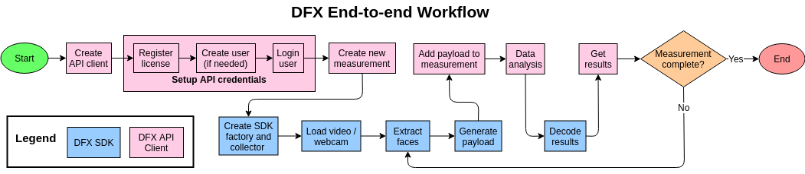

**This demo is now retired in favour of the new [dfx-demo-py](https://github.com/nuralogix/dfx-demo-py).** 

# DFX Python End to End Demo

This is a demonstration of the complete workflow of DFX SDK and API functionalities.

This end-to-end demo includes the following steps:

* Setting up a DFX API SimpleClient (which handles register license, create and log in user)
* Creating a new measurement
* Extracting face data from a video file or webcam input
* Generating payload chunks from a study file
* Sending payload chunks to API server
* Subscribing to results and receiving measurement results from the API server
* Decoding results and displaying them
* Optional: Saving the payloads and results
* Optional: Saving the visage facepoints of the input video

This document outlines how to set up and use the dfx end-to-end demo.

The basic workflow is illustrated:



For more details, please read [dfxexample.md](./dfxexample.md).

## Setup Requirements

Python 3.6 or above is required.

### Windows

* Install the latest [64-bit version of Python](https://www.python.org/downloads/windows/).
* Install [Git](https://git-scm.com/downloads)
* Install [CMake](https://cmake.org/)
* Install [Visual Studio (or Visual Studio C++ build tools)](https://visualstudio.microsoft.com/downloads/)

Please ensure that Python and CMake are added to `PATH`.

### Ubuntu

You need to ensure you have at least Python 3.6, it's development headers and `venv` installed. On Ubuntu 18.04:

```bash
sudo apt-get install python3.6 python3.6-venv python3.6-dev
```

*Note: On Ubuntu 16.04, you may need to use a PPA to install Python 3.6.*

```bash
sudo add-apt-repository ppa:deadsnakes/ppa
sudo apt-get update
sudo apt-get install python3.6 python3.6-venv python3.6-dev
```

In addition, install the following packages.

```bash
sudo apt-get install git
sudo apt-get install build-essential cmake libopenblas-dev liblapack-dev  # Needed for dlib
```

## Quick Start

1. Make sure you have all dependencies above set up.

2. Create a new Python virtual environment and activate it.

    ```bash
    # On Ubuntu
    python3.6 -m venv dfx-demo
    source dfx-demo/bin/activate
    ```

    ```bat
    REM On Windows
    python -m venv dfx-demo
    dfx-demo\Scripts\activate
    ```

3. Install the following packages in the virtual environment.

   ```bash
    pip install asyncio opencv-python
    pip install dlib  # This may take a long time to finish
    ```

    *Note: On Ubuntu 16.04, installing `dlib` in an existing Python virtual environment that was created before Python 3.6 was installed will create dependency issues due to conflicts between `python3-dev` and `python3.6-dev`.*

4. Install the DFX SDK (`libdfx`) after downloading the appropriate `.whl` package for your OS from [the DeepAffex website](https://www.deepaffex.ai/en/developers-sdk.html)

   ```bash
   pip install ./libdfx-{versionspecificinfo}.whl
   ```

5. Install the DFX API SimpleClient library.

   ```bash
   pip install git+https://github.com/nuralogix/dfx-api-client-python.git
   ```

6. Clone this repository using `git` and navigate to the cloned folder

   ```bash
   git clone https://github.com/nuralogix/dfx-e2e-demo-python.git
   cd dfx-e2e-demo-python
   ```

7. Download the [Dlib face landmarks model](http://dlib.net/files/shape_predictor_68_face_landmarks.dat.bz2) and unzip it to the `/res` folder in the cloned repo.

8. Download the [DFX example data](https://s3.us-east-2.amazonaws.com/nuralogix-assets/dfx-sdk/dfxsdk-example-data.zip) and unzip it. It contains the example video and face-tracking data.

9. Obtain a valid DFX license key, study ID and study configuration file [from NuraLogix](https://deepaffex.ai/en/developers-api.html). The license key and study ID can be obtained by logging into [DFX Dashboard](https://dashboard.deepaffex.ai/login). A sample study configuration file (`.dat`) can be obtained by downloading the DFX C++ Windows/macOS/Linux SDK from [here](https://www.deepaffex.ai/en/developers-sdk.html), and is located in dfxsdk/res/models. 

10. Run the demo. To see usage:

    ```shell
    $python dfxexample.py -h
    usage: dfxexample.py [-h] [-v] [--send_method {REST,rest,websocket,ws}]
                     [--measurement_mode {discrete,streaming,batch,video}]
                     [--server {qa,dev,prod,prod-cn}]
                     [--chunklength CHUNKLENGTH] [--videolength VIDEOLENGTH]
                     [-r RESOLUTION] [--face_detect {brute,fast,smart}]

    DFX SDK Python example program

    positional arguments:
    study                 Path of study file
    imageSrc              Path of video file or numeric ID of web camera
    license_key           DFX API license key
    study_id              DFX API study ID
    email                 User email
    password              User password

    optional arguments:
    -h, --help            show this help message and exit
    -v, --version         show program's version number and exit
    --send_method {REST,rest,websocket,ws}
                            Method for adding/sending data to measurement
    --measurement_mode {discrete,streaming,batch,video}
                            Measurement mode
    --server {qa,dev,prod,prod-cn}
                            Name of server to use
    --chunklength CHUNKLENGTH
                            Length of each video chunk, must be between 5 and 30
                            seconds
    --videolength VIDEOLENGTH
                            Total length of video
    -r RESOLUTION, --resolution RESOLUTION
                            Resolution to open camera e.g. 1280x720
    --face_detect {brute,fast,smart}
                            Face detector caching strategy (smart by default)
    --faces FACES         Path of pre-tracked face points file
    --save_chunks_folder SAVE_CHUNKS_FOLDER
                            Folder to save chunks
    --save_results_folder SAVE_RESULTS_FOLDER
                            Folder to save results
    --save_facepoints     Save the facepoints into a json file; only valid with
                            the --face_detect brute option
    ```

    You will need to provide your valid DFX license key and study ID, and proper credentials (email and password) to run the demo.
