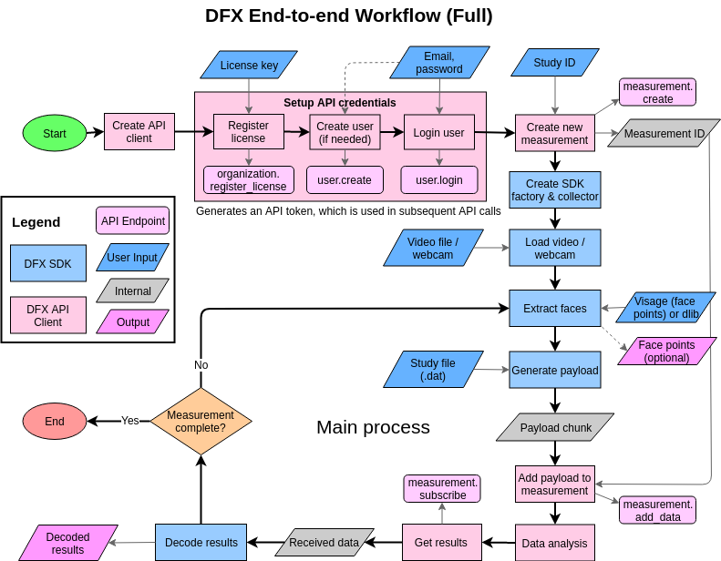

# DFX SDK Python Example - End to End Demo

This document explains the code in `dfxexample.py`, which is an implementation of the DFX end-to-end workflow, using REST and websockets.

## Overview

This workflow is illustrated in the flowchart below:



The process starts by creating a DFX API client object (`dfxapiclient.SimpleClient`), and then setting up the user credentials. This is done by registering the DFX `license_key`, creating a new user (if needed), and logging in the user using an email and a password. This generates an API token that is used for all subsequent API calls, which is handled internally by the DFX API client object.

Next, a new measurement is created under the study given by the `study_id`, by calling the API endpoint `measurement.create`. This generates a `measurement_id`, which is handled internally by the DFX API client object.

A video source is loaded (either a video file or webcam input) into the SDK, which then reads its frames and extracts the faces. A payload is generated from the study file configuration, and payload chunks are generated from the video source.

The payload chunks are then added to the measurement by calling the `measurement.add_data` API endpoint. The data is analyzed, and then retrieved by calling the `measurement.subscribe_to_results` endpoint. The output is decoded by the SDK. The cycle would continue until the measurement is complete.

## Code Explanation

The end-to-end example depends on the following packages:

```python
import argparse     # Parse arguments
import asyncio      # Python asynchronous io
import json
import math
import os
import platform
import sys

import cv2          # Opencv for video processing
import libdfx as dfx       # DFX SDK
import numpy as np         # Numpy for dealing with arrays

# Utilities
from utils import createDFXFace, drawImage, findVideoRotation, readFrame, savePayload
from dlib_tracker import DlibTracker        # Facetracker
from dfxapiclient import SimpleClient       # DFX API client
```

Before you move onto the actual code, make sure you have a good understanding of *asynchronous programming*, as the entire end-to-end example relies heavily on async.

Also, it would be helpful to look up the documentations for the DFX API client and DFX SDK before you read this, as it will help you understand the use cases.

### Helper Functions

#### `main`

```python
async main(args:argparse.Namespace)
```

The main function here is called to run the end-to-end workflow. It takes in a set of user input parameters `args` (for details, scroll down to the section **Call to Main**).

It references a method to set up the DFX API client (discussed below), creates a DFX Extractor object and initializes it (discussed below), and then calls the method `doExtraction` to start the main activities such as face extraction, payload generation, analysis, and decoding.

```python
# Set up DFX API client
# Need to wait since sometimes we cannot connect to the API server
try:
    dfxapiclient = await asyncio.wait_for(_setup_apiclient(args.license_key, 
                                                           args.study_id, 
                                                           args.email, 
                                                           args.password, 
                                                           args.chunklength, 
                                                           args.videolength, 
                                                           args.server, 
                                                           args.measurement_mode, 
                                                           args.send_method), 
                                                           timeout=20)
except TimeoutError:
    raise Exception("Cannot connect to API server. Try again later.")

# Create DFX Extractor object and initialize
extractor = await DfxExtractor.create()
await extractor.initialize(studyCfgPath=args.study, dfxclient=dfxapiclient)

# Run the main extraction process
await extractor.doExtraction(imageSrcPath=args.imageSrc,
                             faceDetectStrategy=args.face_detect,
                             outputPath=args.save_chunks_folder,
                             resultsPath=args.save_results_folder,
                             resolution=args.resolution,
                             preTrackedFacesPath=args.faces,
                             chunkDuration=args.chunklength,
                             videoDuration=args.videolength,
                             save_faces=args.save_facepoints,
                             user_demographics=args.user_demographics)
```

#### `_setup_apiclient`

```python
async _setup_apiclient(license_key:str,
                       study_id:str,
                       email:str,
                       password:str,
                       chunk_length:int,
                       video_length:int,
                       server:str,
                       measurement_mode:str,
                       send_method:str)
```

This method sets up the DFX API client and creates a new measurement.

It is done by creating a `dfxapiclient.SimpleClient` object, and calling the method `create_new_measurement`.

```python
# Initialize DFX API SimpleClient
client = SimpleClient(
    license_key, study_id, email, password, server=server,
    config_file="./example.config", add_method=send_method,
    chunk_length=int(chunk_length), video_length=int(video_length),
    measurement_mode=measurement_mode)

# Create new measurement
client.create_new_measurement()

return client
```

### `DfxExtractor`

#### Constructor

The constructor creates a `libdfx.Factory` object to facilitate data collection. It also defines an empty collector object and two queues (`asyncio.Queue`) for reading frames and storing chunks.

```python
def __init__(self):
    self._cancel = False
    self._complete = False
    self._results = {}
    self._signal = 1    # Time interval for polling

    # Create a DFX Factory object
    self._dfxFactory = dfx.Factory()
    print("Created DFX Factory:", self._dfxFactory.getVersion())

    # Create an empty self._collector
    self._collector = None

    # Create queues
    self._readerQueue = asyncio.Queue(30)
    self._chunkQueue = asyncio.Queue(5)
```

#### `create`

```python
@classmethod
async create(cls)
```

This method provides an alternative way of creating a `DfxExtractor` object. It is needed to ensure that async objects are all created in the same async loop. 

```python
@classmethod
async def create(cls):
    self = DfxExtractor()
    return self
```

#### `_readFrames`

```python
async _readFrames(self, videoCapture:cv2.VideoCapture, rotation:int, mirror:boolean, targetFPS:int)
```

This function calls a method `readFrame` from `utils` to get a frame from the video, which then gets put into the queue `self._readerQueue` to wait to be processed. Once the video ends, indicated by the flag `self._cancel`, the value `None` is put in the queue instead to indicate the end. The `read` flag tells the program if this chunk needs to be processed. For the last chunk, it is marked as `False`.

```python
while not self._cancel:
    read, frame = await readFrame(videoCapture, targetFPS, rotation, mirror)
    await self._readerQueue.put((read, frame))
await self._readerQueue.put((False, None))
```

#### `_processChunks`

```python
async _processChunks(self, outputFolder:str)
```

This is a method for processing every payload chunk. It first retrieves a chunk from the queue `self._chunkQueue`. If the queue is already empty, this method ends.

```python
while True:
    # Get chunk from queue
    chunk = await self._chunkQueue.get()
    if chunk is None:
        break
```

It then updates the printout message, saves the payload files if needed (as indicated by `outputFolder`), and sends the payload to the API by calling the method `dfxapiclient.add_chunk`, where `dfxapiclient` is a `dfxapiclient.SimpleClient` object. Finally, the queue `self._chunkQueue` is marked as complete by calling `task_done()`.

```python
    # Reset results (for message printout)
    self._results = {
        "Chunk Number": chunk.chunk_number + 1,
        "Results": "Processing..."
    }

    # Save file if indicated
    if outputFolder and outputFolder != '':
        savePayload(chunk, outputFolder)

    # Add data to measurement
    await self.dfxapiclient.add_chunk(chunk)

    # Mark as complete
    self._chunkQueue.task_done()
self._chunkQueue.task_done()
```

#### `_getChunk`

```python
async _getChunk(self, collector:libdfx.Collector)
```

This function retrieves a chunk from the collector (`dfxFactory.Collector`) object, by calling the method `getChunkData()`. The payload is then retrieved by calling the method `.getChunkPayload()`. It is then put in a queue `self._chunkQueue` for processing chunks.

```python
chunkData = collector.getChunkData()
if chunkData is not None:
    chunkPayload = chunkData.getChunkPayload()
    await self._chunkQueue.put(chunkPayload)
    print("Got chunk with {}".format(chunkPayload))
else:
    print("Got empty chunk")
```

#### `initialize`

```python
async initialize(self, studyCfgPath:str, dfxclient:dfxapiclient.SimpleClient)
```

This method initializes the DFX extractor by setting up the study, collector, and DFX API client. The study is initialized from a `.dat` file provided by `studyCfgPath`. The collector is set by calling `dfxFactory.createCollector()`.

```python
# Initialize a study
if not self._dfxFactory.initializeStudyFromFile(studyCfgPath):
    print("DFX study initialization failed: {}".format(
        self._dfxFactory.getLastErrorMessage()))
    sys.exit(1)
print("Created study from {}".format(studyCfgPath))

# Create collector
self._collector = self._dfxFactory.createCollector()
if self._collector.getCollectorState() == dfx.CollectorState.ERROR:
    print("Collector creation failed: {}".format(
        self._collector.getLastErrorMessage()))
    sys.exit(1)
print("Created collector")

# Set up DFX API client
self.dfxapiclient = dfxclient
```

#### `doExtraction`

```python
async doExtraction(self,
                   imageSrcPath,
                   faceDetectStrategy,
                   outputPath=None,
                   resolution=None,
                   preTrackedFacesPath=None,
                   chunkDuration=15,
                   videoDuration=60,
                   event_loop=None,
                   save_faces=False,
                   user_demographics=None)
```

This is the main method that performs the video extraction process. 

It first creates the json object (dictionary) for saving facepoints. Then it loads the saved face tracking data if it was specified, otherwise it creates a facetracker (`dlib.DlibTracker`) object. It then checks if the camera / webcam is used (camera is usually given as a number as opposed to a string for a video file).

```python
# For saving facepoints
facepoints = {}
facepoints["frames"] = {}

# Load the face tracking data
if preTrackedFacesPath is not None:
    with open(preTrackedFacesPath, 'r') as f:
        preTrackedFaces = json.load(f)["frames"]
else:
    preTrackedFaces = None
    tracker = DlibTracker(face_detect_strategy=faceDetectStrategy)

# Check if camera
try:
    imageSrcPath = int(imageSrcPath)
    isCamera = True
except ValueError:
    isCamera = False
```

Now, the video source is loaded, by calling `cv2.VideoCapture()`. The FPS is retrieved and the duration per frame (in nanoseconds) is calculated.

```python
# Load video capture source
videocap = cv2.VideoCapture(imageSrcPath)
targetFPS = videocap.get(cv2.CAP_PROP_FPS)
try:
    durationOneFrame_ns = 1000000000.0 / targetFPS
except ZeroDivisionError:
    raise ValueError("Invalid or nonexistent video file")
```

If the webcam / camera is used, the measurement duration is automatically set to 30 seconds (~900 frames at 30 fps). The resolution is then set to the camera default.

```python
if isCamera:
    # Set rotation
    mirror = True
    rotation = 0

    videoDuration_frames = 901
    videoFileName = "Camera {}".format(imageSrcPath)

    # Set resolution
    if resolution is not None:
        try:
            width, height, *_ = (int(x) for x in resolution.split('x'))
            videocap.set(cv2.CAP_PROP_FRAME_WIDTH, width)
            videocap.set(cv2.CAP_PROP_FRAME_HEIGHT, height)
        except Exception as e:
            print("Could not set resolution to {} because {}".format(resolution, e))
```

If a video file is used instead, the video rotation is found, and the measurement duration is taken. If the user-specified measurement duration is greater than the length of the actual video, the measurement duration is taken as the length of the video.

```python
else:
    # Probe file using ffprobe to see if it's rotated
    rotation = await findVideoRotation(imageSrcPath)
    mirror = False

    # Count frames (if duration is longer than the video length, take the video length)
    videoDuration_frames = int(1000000000.0 * int(videoDuration) / durationOneFrame_ns)
    if videoDuration_frames > int(videocap.get(cv2.CAP_PROP_FRAME_COUNT)):
        videoDuration_frames = int(videocap.get(cv2.CAP_PROP_FRAME_COUNT))
    videoFileName = os.path.basename(imageSrcPath)
```

Some more parameters are calculated, and the configurations for the collector is set (including user demographics if specified). An output path for saving the payload chunks is created.

```python
chunkDuration_s = int(chunkDuration)
KLUDGE = 1  # This kludge to handle a bug in current SDK
chunkFrameCount = math.ceil(chunkDuration_s * targetFPS + KLUDGE)
numberChunks = math.ceil(videoDuration_frames / chunkFrameCount)

# Set collector config
self._collector.setTargetFPS(targetFPS)
self._collector.setChunkDurationSeconds(chunkDuration_s)
self._collector.setNumberChunks(numberChunks)

# Set user demographics
if user_demographics:
    with open (user_demographics, "r") as f:
        user_info = json.load(f)
        for k, v in user_info.items():
            self._collector.setProperty(k, str(v))

print(...)
...

# Create outputPath folder if it doesn't exist
if outputPath is not None and not os.path.exists(outputPath):
    os.makedirs(outputPath)

self._cancel = False
```

Now, several processes are added into the asynchronous event loop: reading frames, processing chunks (add data and save), subscribe to results, and decode results. The asynchronous io will handle these processes internally, and will run them to completion. The utilization of queues ensure that data can be passed in between the processes asynchronously.

```python
# Read video frames
asyncio.ensure_future(self._readFrames(videocap, rotation, mirror, targetFPS))

# Add to measurement and save
asyncio.ensure_future(self._processChunks(outputPath))

# Subscribe to results
asyncio.ensure_future(self.dfxapiclient.subscribe_to_results())

# Decode and display
asyncio.ensure_future(self.decode_results())
```

Now, the measurement can begin, and signal is given.

```python
isMeasurementStarted = False
startFrameNumber = 0
if not isCamera:
    # Start collection
    self._collector.startCollection()
    isMeasurementStarted = True
frameNumber = 0
success = False
```

This begins the main loop. Each iteration takes one camera / video frame and processes it. The loop continues until the measurement is complete, as signalled by the `read` flag.

```python
while True:
    # Get frame from the readerQueue
    read, image = await self._readerQueue.get()
    # This makes sense as we are joining outside the loop
    self._readerQueue.task_done()

    if not read:
        # Video ended, so grab what should be the last, possibly truncated chunk
        await self._getChunk(self._collector)
        success = True
        break
```

The video frame is then created (a `libdfx.VideoFrame` object). The DFX frame object is created by calling `collector.createFrame(videoFrame)`.

```python
    # Make a copy for rendering
    renderImage = np.copy(image)

    # Create a dfx_video_frame
    if isCamera:
        frameNumber += 1
    else:
        frameNumber = int(videocap.get(cv2.CAP_PROP_POS_FRAMES))

    videoFrame = dfx.VideoFrame(image, frameNumber,
                                frameNumber * durationOneFrame_ns,
                                dfx.ChannelOrder.CHANNEL_ORDER_BGR)

    # Create a dfx_frame from the dfx_video_frame
    frame = self._collector.createFrame(videoFrame)
```

Now, the facetracker (visage) needs to be added onto the video frame for tracking the face regions. If there are no pre-tracked facepoints available, it uses the dlib facetracker (`tracker`) to track the face (tracker.trackFaces()). It saves the facepoints in json format if prompted. It then calls `createDFXFace()` to create a DFX face.

Otherwise, if the pre-tracked facepoints are provided for this video, it just adds the face to the frame.

```python
    # Add the dfx_face to the dfx_frame
    if preTrackedFaces is None:
        faces = tracker.trackFaces(image, None)

        for id, jsonFace in faces.items():
            # Store facepoints for saving if needed
            if save_faces:
                facepoints["frames"][frameNumber] = jsonFace
            
            face = createDFXFace(self._collector, jsonFace)
            frame.addFace(face)
    else:
        face = createDFXFace(self._collector, preTrackedFaces[str(frameNumber)])
        frame.addFace(face)
```

A marker is added to the 1000th frame. The extraction process is done by first defining the facial regions (`collector.defineRegions()`) and then extracting from these regions / channels (`collector.extractChannels()`). Then it checks if this frame is the last one.

```python
    # Add a marker to the 1000th dfx_frame
    if frameNumber == 1000:
        frame.addMarker("This is the 1000th frame")

    # Do the extraction
    self._collector.defineRegions(frame)
    result = self._collector.extractChannels(frame)

    # Grab a chunk and check if we are finished
    if result == dfx.CollectorState.CHUNKREADY or result == dfx.CollectorState.COMPLETED:
        await self._getChunk(self._collector)
        if result == dfx.CollectorState.COMPLETED:
            print("\ndfx.CollectorState.COMPLETED at frame {}".format(frameNumber))
            success = True
            print("Exiting")
            break
```

Here, the image (with the facetracker) is rendered in a window. The frame number, status, as well as the measurement results are also displayed. 

```python
    # Rendering
    msg = ", press 'q' to cancel"
    if isMeasurementStarted:
        msg = "Measurement started" + msg
    else:
        msg = "Press 's' to start measurement" + msg
    renderImageLast = np.copy(renderImage)
    drawImage(frame, renderImage, videoFileName, frameNumber - startFrameNumber,
                videoDuration_frames, targetFPS, isMeasurementStarted,
                self._results, msg)
    cv2.imshow('DFX End-to-end Demo', renderImage)
    key = cv2.waitKey(1) & 0xFF

    # Press q to exit
    if key == ord('q'):
        success = False
        break

    # For webcam only (press s to start)
    if not isMeasurementStarted and key == ord('s'):
        self._collector.startCollection()
        isMeasurementStarted = True
        startFrameNumber = frameNumber
```

Now that the main loop is finished, here comes the closing process. First, all the queues are cleared (otherwise errors will be raised when program is closed). Then, the facepoints are saved in a json file if prompted. We then call `dfxapiclient.retrieve_results()` to check the results for this measurement. Finally, a message is displayed on the video window.

```python
# Signal read done
self._cancel = True

# Flush the queue of any leftover frames
while not self._readerQueue.empty():
    await self._readerQueue.get()
    self._readerQueue.task_done()
await self._readerQueue.join()  # Wait for reader queue to finish

# Send an empty frame to chunk queue to signal finish
await self._chunkQueue.put(None)
await self._chunkQueue.join()  # Wait for chunk queue to finish

# Flag for signalling complete
self._complete = True

# Save face points if prompted
if save_faces:
    print("\nSaving facepoints")
    imageSrcPath = imageSrcPath.strip(".mov").strip(".mp4")
    fp_file = imageSrcPath + "-faces.json"
    with open(fp_file, 'w') as fp:
        json.dump(facepoints, fp)

# Retrieve results for this measurement
res = self.dfxapiclient.retrieve_results()
print(res)

msg = "Collection finished completely - press 'q' to exit" if success else "Collection interrupted or failed - press 'q' again to exit"
print("\n", msg)
await asyncio.sleep(self._signal)
```

The last image is displayed on the window until dismissed. When dismissed, all image captures are released and windows are closed. A call is made to the DFX API client to shut itself down gracefully.

```python
# Keep displaying image until dismissed (by pressing q)
drawImage(frame, renderImageLast, videoFileName, 0, 0, targetFPS,
            isMeasurementStarted, self._results, msg)
while True:
    cv2.imshow('DFX End-to-end Demo', renderImageLast)
    await asyncio.sleep(self._signal)
    if cv2.waitKey(1) & 0xFF == ord('q'):
        break

# When everything done, release the capture
videocap.release()
cv2.destroyAllWindows()

# Shut down DFX API client activities
await self.dfxapiclient.shutdown()
```

#### `decode_results`

```python
async decode_results(self, outputPath:str)
```

This method decodes all the results received from the server, in a polling format. Until the program stops, it continuously checks if the queue `self.dfxapiclient.received_data` has content, and if so, it retrieves a chunk of data from the queue. If prompted, the file is saved as in binary format.

Then, it calls the SDK method `collector.decodeMeasurementResult()` to get the decoded results. The result is a custom object that needs to be processed further. It calls the method `getErrorCode()` to get the error code for this chunk if there is any.

```python
while not self._complete:
    counter = 0
    # Check the queue of received chunks
    if not self.dfxapiclient.received_data.empty():
        # Get chunk from queue
        chunk = await self.dfxapiclient.received_data.get()

        # Save results if output folder given
        if outputPath and outputPath != "":
            if not os.path.exists(outputPath):
                os.makedirs(outputPath)
            with open(outputPath + '/result_' + str(counter) + '.bin', 'wb') as f:
                f.write(chunk)
        counter += 1

        # Decode the data
        decoded_data = self._collector.decodeMeasurementResult(chunk)
        chunk_result = {}   # For storing chunk result

        # Get error message
        error_msg = decoded_data.getErrorCode()
        if error_msg != "OK":
            print(" Error message: ", error_msg)
            self._results["Error"] = error_msg
```

It then checks if the decoded results contain keys of measurement parameters. If so, for each parameter (key), the raw data is obtained in a `list` format by calling `decoded_data.getMeasurementData(key).getData()`. For display purposes, the mean of each set of raw data is computed. 

Finally, the queue must be marked as complete by calling `.task_done()`. If the queue is empty, this method will continue polling.

```python
        if decoded_data.getMeasurementDataKeys():
            self._results["Results"] = "Success"    # Screen display message

            # Iterate through keys in the measurement result
            for key in decoded_data.getMeasurementDataKeys():
                # Get the data for each key
                data = decoded_data.getMeasurementData(key).getData()

                chunk_result[key] = data    # Store chunk results

                # Compute a mean for the data points
                if len(data) > 0:
                    mean = round(float(sum(data) / len(data)), 2)
                    self._results[key] = mean
                else:
                    mean = 'N/A'
                print(key, mean)

        else:   # If results are empty
            print("None")
            self._results["Results"] = "None"   # Screen display message

        # Mark queue as complete
        self.dfxapiclient.received_data.task_done()
    
    # If queue is empty, continue polling
    else:
        await asyncio.sleep(self._signal)      # Polling
```

### Call to Main

This part, under the `if __name__ == '__main__'` block, takes in the user input arguments, creates an asynchronous event loop, and runs the `main()` function in the event loop.

For more information about the arguments, check the `help=` section defined in each argument.

```python
# Input arguments
parser = argparse.ArgumentParser(description="DFX SDK Python example program")

parser.add_argument("-v",
                    "--version",
                    action='version',
                    version='%(prog)s {}'.format(dfx.__version__))

parser.add_argument("study", help="Path of study file")

parser.add_argument("imageSrc",
                    help="Path of video file or numeric ID of web camera")

parser.add_argument("license_key", help="DFX API license key")

parser.add_argument("study_id", help="DFX API study ID")

parser.add_argument("email", help="User email")

parser.add_argument("password", help="User password")

parser.add_argument("--send_method",
                    help="Method for adding/sending data to measurement",
                    choices=["REST", "rest", "websocket", "ws"],
                    default="REST")

parser.add_argument("--measurement_mode",
                    help="Measurement mode",
                    choices=["discrete", "streaming", "batch", "video"],
                    default="discrete")

parser.add_argument("--server",
                    help="Name of server to use",
                    choices=["qa", "dev", "prod", "prod-cn"],
                    default="prod")

parser.add_argument("--chunklength",
                    help="Length of each video chunk, must be between 5 and 30 seconds",
                    default=15)

parser.add_argument("--videolength",
                    help="Total length of video",
                    default=60)

parser.add_argument("--user_demographics", 
                    help="Json file that contains user demographics")

parser.add_argument("-r",
                    "--resolution",
                    help="Resolution to open camera e.g. 1280x720")

parser.add_argument("--face_detect",
                    help="Face detector caching strategy (smart by default)",
                    choices=["brute", "fast", "smart"],
                    default="smart")

parser.add_argument("--faces", help="Path of pre-tracked face points file")

parser.add_argument("--save_chunks_folder", help="Folder to save chunks")

parser.add_argument("--save_results_folder", help="Folder to save results")

parser.add_argument("--save_facepoints",
                    action="store_true",
                    help="Save the facepoints into a json file; only valid with the --face_detect brute option")

args = parser.parse_args()

if platform.system() == 'Windows':
    asyncio.set_event_loop_policy(asyncio.WindowsProactorEventLoopPolicy())

# Main event loop
loop = asyncio.get_event_loop()
loop.run_until_complete(main(args))
loop.close()
```

